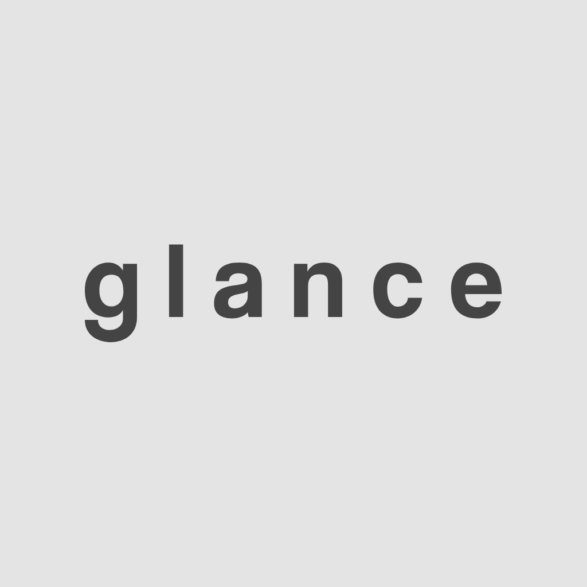
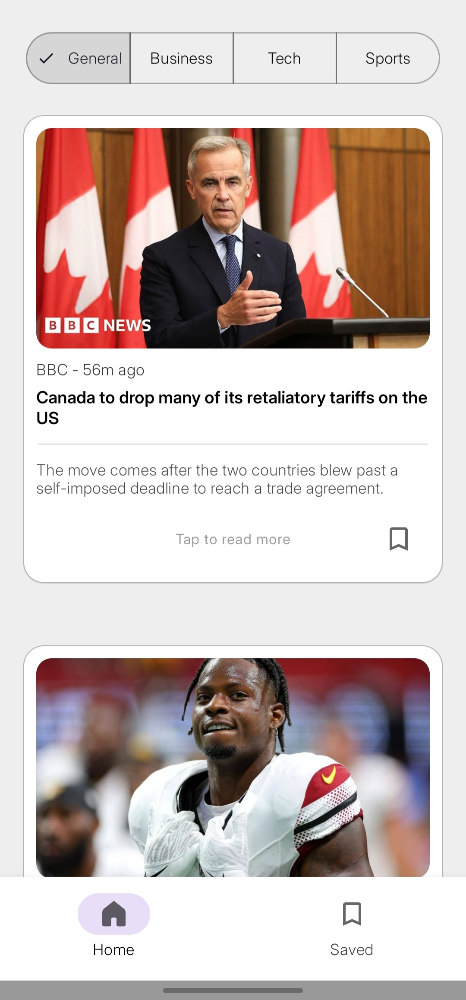
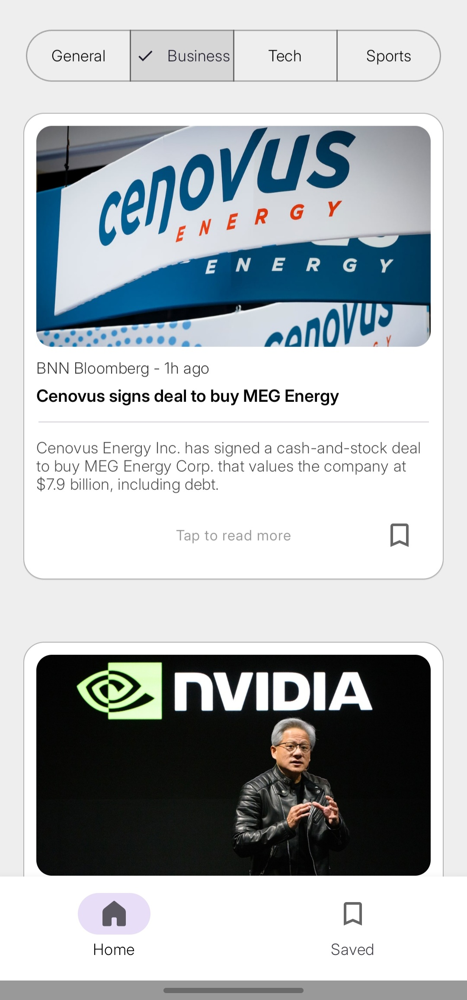
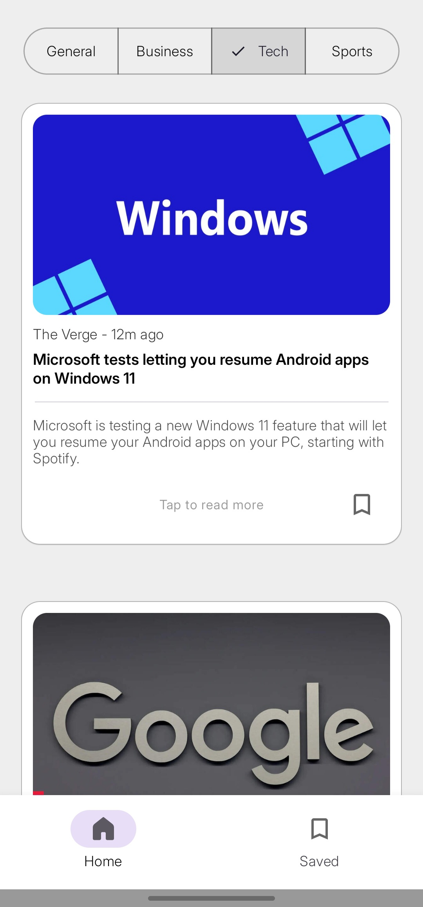
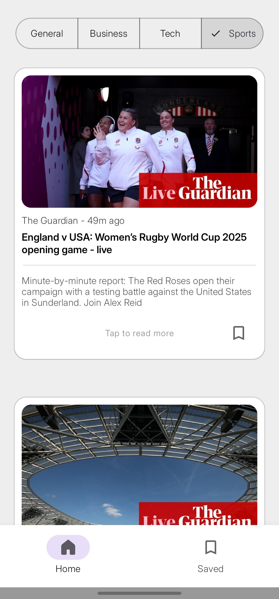
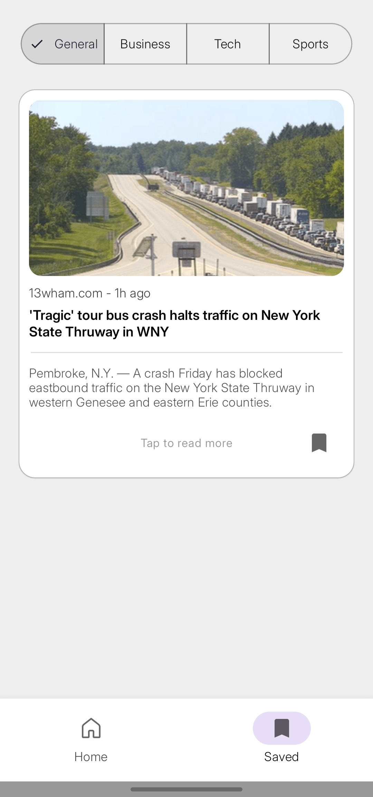
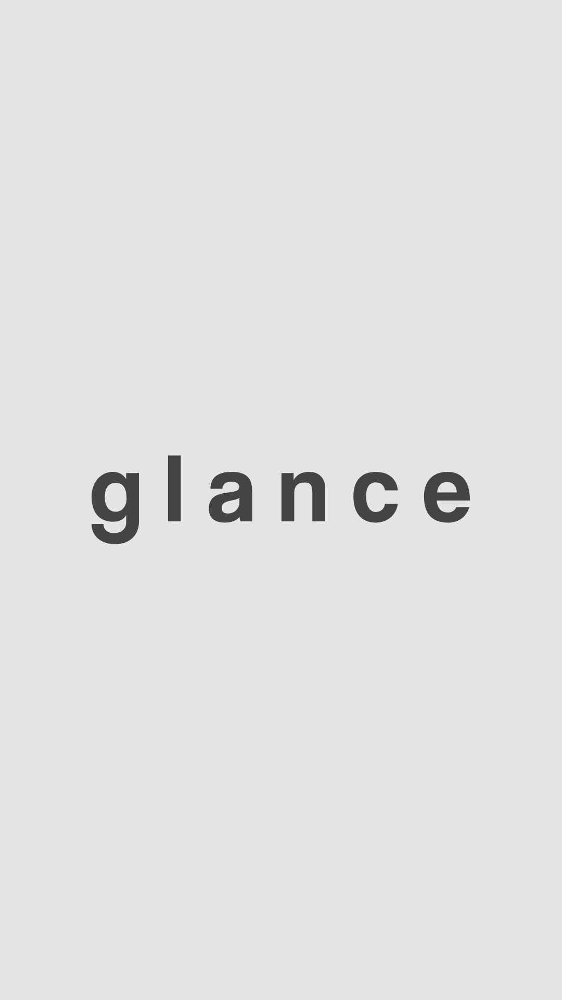

# 📰 Glance

<table>
  <tr>
    <td width="200">
      
    </td>
    <td>
      <p>
        <b>Glance</b> is a simple Android news app built with Jetpack Compose and Material 3.
        Stay up to date with general, business, technology, and sports news, save favourite 
        articles, and browse through a minimal interface designed for quick reading 
        and smooth navigation.
      </p>
    </td>
  </tr>
</table>

---

## 🖼️ Screenshots

<table>
  <tr>
    <td align="center"><b>General News</b></td>
    <td align="center"><b>Business News</b></td>
    <td align="center"><b>Technology News</b></td>
  </tr>
  <tr>
    <td></td>
    <td></td>
    <td></td>
  </tr>
  <tr>
    <td align="center"><b>Sports News</b></td>
    <td align="center"><b></b></td>
    <td align="center"><b>Saved Articles</b></td>
  </tr>
  <tr>
    <td></td>
    <td></td>
    <td></td>
  </tr>
</table>

---

## 🎥 Demo Video

<a href="https://vimeo.com/1112391657">
  
</a>

> 📹 A walkthrough of the app, including browsing different categories, saving articles, and exploring the Material 3 UI.

---

## ⚙️ Tech Stack

- **Kotlin**, **Jetpack Compose**, **MVVM**
- **Hilt** for dependency injection
- **Spring Boot** backend with WebFlux
- **Retrofit** for API calls
- **GNews API** for fetching news
- **Room** for local persistence (saved articles)
- **Coil** for async image loading
- **Material 3** with expressive components

---

## 🛠️ Setup Guide

### Android App

1. Clone the repo:
   ```bash
   git clone https://github.com/AntoOfo/glance-app
   cd glance-app
    ```
2. Open the project in Android Studio.

3. Let Gradle sync and build.

4. Run the app on an emulator or physical device.

### Backend (Spring Boot)

1. The backend is located in the glance-backend/ folder.

2. You'd need Java 17 and a valid GNews API key in **application.properties:**
   ```bash
   gnews.api.key=YOUR_API_KEY
    ```
3. Run it locally.

## 📁 License

Licensed under the MIT License.
